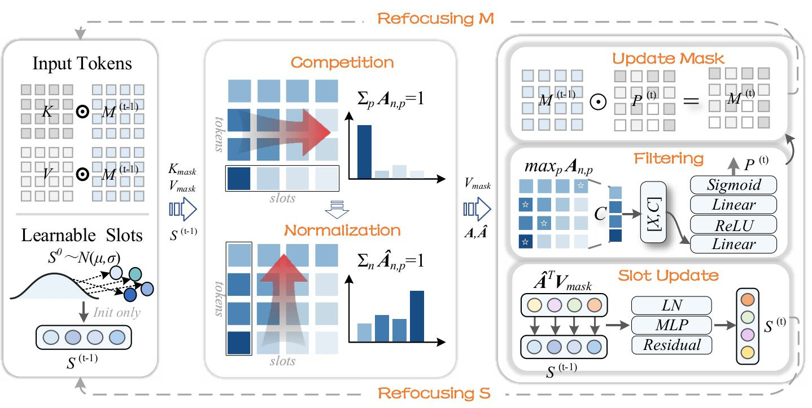
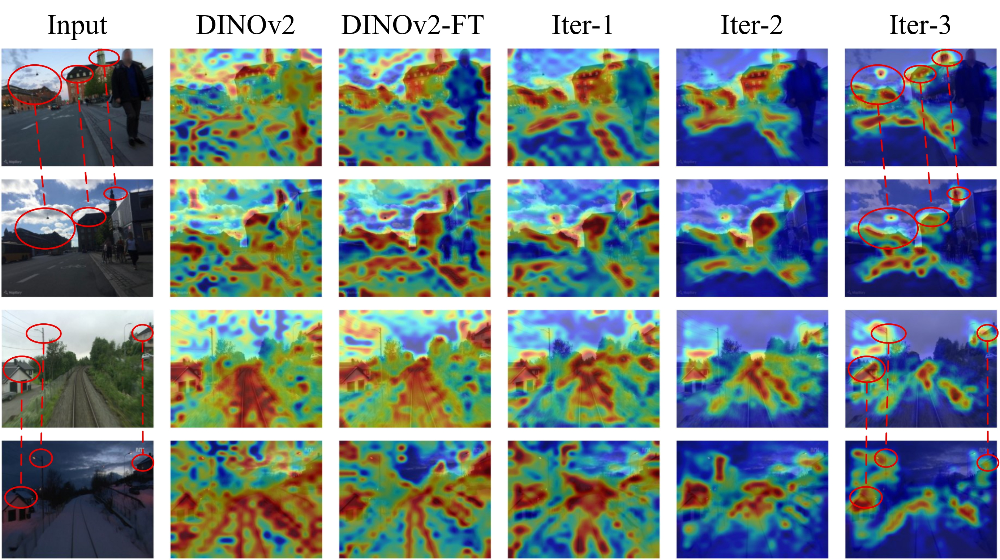
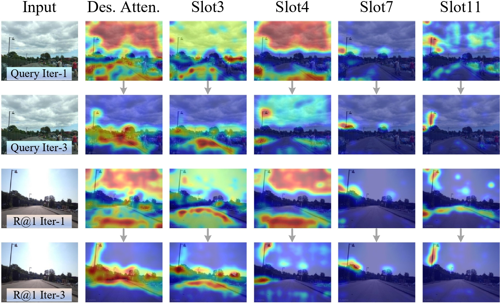

# Rethinking the Aggregation Head: Competitive Slot Distillation for Robust Visual Place Recognition

> Recasting feature aggregation as an iterative **competition → filtering → refocusing** loop.

## Abstract

Visual Place Recognition (VPR) localizes a query image by retrieving the best-matching
place from a large geo-tagged database. The key challenge is aggregating **stable structural
cues** from distractor-saturated scenes into a global descriptor.

We propose **Competitive Slot Distillation (CoSDi)**, which recasts aggregation as an
**iterative structure-distillation** process. Only **20 learnable slots** compete over scene
features via a **zero-sum assignment**, so they specialize in complementary structures. The
resulting affinity matrix is **directly reused to filter unreliable regions — no auxiliary
model (e.g., segmentation) needed**, forming a self-reinforcing **competition → filtering →
refocusing** loop.

**Results:** SOTA on 8 VPR benchmarks (**+4.3% R@1 on Nordland**), and transfers directly to
Cross-View Geo-Localization (**+6.09% R@1 over MEAN** on SUES-200 Drone→Satellite).

## Method

One CoSDi iteration:
1. **Competition** — slots compete over tokens via softmax along the slot dimension (zero-sum); each token is claimed by its most relevant slot.
2. **Filtering** — the per-token max claim gates a token mask `M` that suppresses unreliable regions.
3. **Refocusing** — the cleaned features and updated slots feed the next iteration.
   
<p align="center"></p>

## Visualization

<p align="center">
  
  
</p>

**(a) Left** — across iterations, CoSDi focuses on discriminative structures and
suppresses distractors (pedestrians, sky, snow); the query and its retrieved match
converge to consistent regions. **(b) Right** — individual slots specialize in
complementary cues (buildings, road, landmarks), and the **same slot aligns to
corresponding structures across a query and its top-1 match**.


## Installation

```bash
conda create -n cosdi python=3.10 -y
conda activate cosdi
pip install torch torchvision lightning faiss-gpu numpy pillow scikit-learn tqdm matplotlib
# DINOv2 backbone is pulled automatically via torch.hub on first run.
```

---

## Pretrained Weights

| Model           | Task | Backbone   | Download |
|-----------------|------|------------|----------|
| `CoSDi-VPR.ckpt`  | VPR  | DINOv2-B   | [Baidu Pan](https://pan.baidu.com/s/1d7nCkS6S70HXhwMcbh_8aw?pwd=1234) (code: `1234`) |
| `CoSDi-CVGL.ckpt` | CVGL | DINOv2-B   | [Baidu Pan](https://pan.baidu.com/s/13vPR1qubficL6gYaXDqo1g?pwd=1234) (code: `1234`) |

> Weights are hosted on Baidu Pan (extraction code: `1234`).

---

## Datasets

| Dataset | Source |
|---|---|
| GSV-Cities (train, VPR) | https://github.com/amaralibey/gsv-cities |
| MSLS / Pitts / Nordland / SPED / SVOX / Tokyo24-7 | [VPR-datasets-downloader](https://github.com/gmberton/VPR-datasets-downloader) |
| AmsterTime | https://github.com/seyrankhademi/AmsterTime |
| Baidu Mall | via [VPR-datasets-downloader](https://github.com/gmberton/VPR-datasets-downloader) / [AnyLoc](https://github.com/AnyLoc/AnyLoc) |
| University-1652 (CVGL) | https://github.com/layumi/University1652-Baseline |
| SUES-200 (CVGL) | https://github.com/Reza-Zhu/SUES-200-Benchmark |

Each VPR test set follows the `*_dbImages.npy` / `*_qImages.npy` / `*_gt*.npy`
index format and lives under `--data_root/<dataset_name>/`.

---

## VPR — Training & Testing

**Train** (GSV-Cities, DINOv2-B, edit data paths inside `train_GSV_VPR.py`):
```bash
python train_GSV_VPR.py
```

**Test** on all 14 VPR benchmarks (one run, unified pipeline):
```bash
python eval_all_cosdi.py \
    --ckpt CoSDi-VPR.ckpt \
    --data_root /path/to/data
```

---

## CVGL — Training & Testing

The **same CoSDi network** is reused; only the data/task differ.

**Train** on University-1652:
```bash
python train_u1652.py \
    --train_path /path/to/University-Release/train \
    --test_path  /path/to/University-Release/test
```

**Test on University-1652** (drone↔satellite, both directions):
```bash
python eval_u1652.py \
    --ckpt CoSDi-CVGL.ckpt \
    --test_path /path/to/University-Release/test
```

**Test on SUES-200** (4 heights × both directions, cross-dataset generalization):
```bash
python eval_sues.py \
    --ckpt CoSDi-CVGL.ckpt \
    --test_path /path/to/SUES-200-512x512-V2/SUES-200-512x512
```

---

## Results

### VPR (14 benchmarks)

<table>
<thead><tr><th width="220">Dataset</th><th width="135">R@1</th><th width="135">R@5</th><th width="135">R@10</th><th width="135">R@15</th></tr></thead>
<tbody>
<tr><td align="center">MSLS-val</td><td align="center">94.19</td><td align="center">97.03</td><td align="center">97.16</td><td align="center">97.30</td></tr>
<tr><td align="center">Nordland*</td><td align="center">84.96</td><td align="center">94.13</td><td align="center">96.16</td><td align="center">97.03</td></tr>
<tr><td align="center">Tokyo24/7</td><td align="center">97.46</td><td align="center">99.05</td><td align="center">99.37</td><td align="center">99.37</td></tr>
<tr><td align="center">AmsterTime</td><td align="center">62.06</td><td align="center">82.29</td><td align="center">86.35</td><td align="center">88.30</td></tr>
<tr><td align="center">SPED</td><td align="center">91.76</td><td align="center">96.21</td><td align="center">96.87</td><td align="center">97.20</td></tr>
<tr><td align="center">Baidu</td><td align="center">70.77</td><td align="center">83.38</td><td align="center">88.22</td><td align="center">90.36</td></tr>
<tr><td align="center">SVOX-overcast</td><td align="center">98.28</td><td align="center">99.31</td><td align="center">99.43</td><td align="center">99.54</td></tr>
<tr><td align="center">SVOX-night</td><td align="center">97.57</td><td align="center">99.39</td><td align="center">99.51</td><td align="center">99.51</td></tr>
<tr><td align="center">SVOX-sun</td><td align="center">98.01</td><td align="center">99.18</td><td align="center">99.30</td><td align="center">99.53</td></tr>
<tr><td align="center">SVOX-rain</td><td align="center">98.61</td><td align="center">99.47</td><td align="center">99.68</td><td align="center">99.79</td></tr>
<tr><td align="center">SVOX-snow</td><td align="center">99.43</td><td align="center">99.66</td><td align="center">99.77</td><td align="center">99.77</td></tr>
<tr><td align="center">Pitts30k-test</td><td align="center">93.21</td><td align="center">96.89</td><td align="center">97.98</td><td align="center">98.34</td></tr>
<tr><td align="center">Pitts250k-test</td><td align="center">96.04</td><td align="center">98.66</td><td align="center">99.46</td><td align="center">99.65</td></tr>
</tbody>
</table>

### CVGL — University-1652

<table>
<thead><tr><th width="280">Direction</th><th width="120">R@1</th><th width="120">R@5</th><th width="120">R@10</th><th width="120">mAP</th></tr></thead>
<tbody>
<tr><td align="center">Drone → Satellite (d2s)</td><td align="center">94.55</td><td align="center">99.12</td><td align="center">99.42</td><td align="center">96.65</td></tr>
<tr><td align="center">Satellite → Drone (s2d)</td><td align="center">97.43</td><td align="center">98.72</td><td align="center">99.00</td><td align="center">93.92</td></tr>
</tbody>
</table>

### CVGL — SUES-200 (cross-dataset, trained on University-1652)

<table>
<thead><tr><th width="120">Height</th><th width="140">Direction</th><th width="125">R@1</th><th width="125">R@5</th><th width="125">R@10</th><th width="125">AP</th></tr></thead>
<tbody>
<tr><td align="center">150</td><td align="center">d2s</td><td align="center">90.07</td><td align="center">97.28</td><td align="center">98.45</td><td align="center">93.28</td></tr>
<tr><td align="center">150</td><td align="center">s2d</td><td align="center">96.25</td><td align="center">97.50</td><td align="center">97.50</td><td align="center">88.43</td></tr>
<tr><td align="center">200</td><td align="center">d2s</td><td align="center">95.55</td><td align="center">98.83</td><td align="center">99.37</td><td align="center">97.01</td></tr>
<tr><td align="center">200</td><td align="center">s2d</td><td align="center">98.75</td><td align="center">98.75</td><td align="center">98.75</td><td align="center">94.77</td></tr>
<tr><td align="center">250</td><td align="center">d2s</td><td align="center">97.68</td><td align="center">99.62</td><td align="center">99.77</td><td align="center">98.51</td></tr>
<tr><td align="center">250</td><td align="center">s2d</td><td align="center">98.75</td><td align="center">100.00</td><td align="center">100.00</td><td align="center">97.30</td></tr>
<tr><td align="center">300</td><td align="center">d2s</td><td align="center">98.62</td><td align="center">99.77</td><td align="center">99.92</td><td align="center">99.15</td></tr>
<tr><td align="center">300</td><td align="center">s2d</td><td align="center">98.75</td><td align="center">100.00</td><td align="center">100.00</td><td align="center">98.10</td></tr>
</tbody>
</table>
