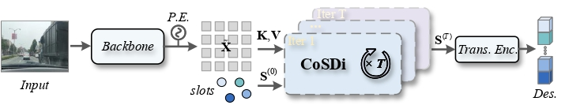

# CoSDi: Competitive Slot Distillation for Robust Visual Place Recognition

### Rethinking the Aggregation Head: Competitive Slot Distillation for Robust Visual Place Recognition

> Code: https://github.com/guanyuzong/CoSDi-VPR

---

## Abstract

Visual Place Recognition (VPR) localizes a query image by retrieving the
best-matching place from a large-scale geo-tagged database. Its key challenge
lies in aggregating **stable structural cues** from distractor-saturated scenes
into a global descriptor. Existing aggregation methods follow a **single-pass**
paradigm that struggles to disentangle informative cues from distractors, and
largely offload this burden onto auxiliary external modules.

Inspired by natural selection, we recast aggregation as an **iterative
structure-distillation** process. We propose **Competitive Slot Distillation
(CoSDi)**, which uses only **20 learnable prototypes (slots)** that interact with
scene features to form an affinity matrix, and imposes a **zero-sum assignment
along the slot dimension** so that slots specialize in complementary structures.
Because the competition itself reveals which regions are most strongly absorbed
by the slots, this affinity matrix is **directly reused as an intrinsic filtering
signal** to suppress unreliable regions **without any auxiliary model** (e.g.,
segmentation), forming a self-reinforcing **competition → filtering → refocusing**
loop.

On eight VPR benchmarks CoSDi outperforms state-of-the-art methods (**+4.3% R@1
on Nordland**). Without any task-specific modification, CoSDi transfers directly
to **Cross-View Geo-Localization (CVGL)**, achieving **+6.09% R@1 over MEAN** on
SUES-200 Drone→Satellite cross-dataset generalization — validating CoSDi as a
general visual-retrieval aggregation framework.

---

## Method

**Overall pipeline.** Given an input image, DINOv2 produces patch tokens that are
augmented with positional encoding (P.E.). A set of learnable slots `S^(0)` then
interacts with the tokens `X̃` through `T` iterations of CoSDi, yielding refined
slots `S^(T)`, which are aggregated into the global descriptor via a Transformer
encoder (Trans. Enc.) layer.



**Inside one CoSDi iteration** — competition → filtering → refocusing:


CoSDi replaces the single-pass aggregation head with an iterative loop. At each
iteration: (1) **Competition** — slots compete over scene tokens via a softmax
along the slot dimension (zero-sum assignment), so each token is claimed by its
most relevant slot; (2) **Filtering** — the per-token max claim drives a light
gate that produces a token mask `M`, suppressing unreliable regions; (3)
**Refocusing** — the cleaned feature pool and updated slots feed the next
iteration. The final slots are projected and concatenated into the global
descriptor.

---

## Visualization


**(a) Evolution of descriptor-attention heatmaps across CoSDi iterations.**
Starting from DINOv2 (raw) and DINOv2-FT (fine-tuned) features, CoSDi
progressively focuses on discriminative structures (red circles) and suppresses
distractors (pedestrians, sky, snow) from Iter-1 to Iter-3. After the final
iteration, the query and its correctly-retrieved database image converge to
consistent regions.


**(b) Individual slot attentions.** The aggregated descriptor attention
(*Des. Atten.*) is the union of all slot attentions, while individual slots
specialize in complementary cues (buildings, road surfaces, vertical landmarks),
consistent with the zero-sum competition. The **same slot attends to
corresponding structures across a query and its top-1 match** (slot-level
structural alignment), and Iter-1 vs Iter-3 shows slots refining toward more
place-discriminative regions.

---

## Installation

```bash
conda create -n cosdi python=3.10 -y
conda activate cosdi
pip install torch torchvision lightning faiss-gpu numpy pillow scikit-learn tqdm matplotlib
# DINOv2 backbone is pulled automatically via torch.hub on first run.
```

---

## Pretrained Weights

| Model           | Task | Backbone   | Download |
|-----------------|------|------------|----------|
| `CoSDi-VPR.ckpt`  | VPR  | DINOv2-B   | [Baidu Pan](https://pan.baidu.com/s/1d7nCkS6S70HXhwMcbh_8aw?pwd=1234) (code: `1234`) |
| `CoSDi-CVGL.ckpt` | CVGL | DINOv2-B   | [Baidu Pan](https://pan.baidu.com/s/13vPR1qubficL6gYaXDqo1g?pwd=1234) (code: `1234`) |

> Weights are hosted on Baidu Pan (extraction code: `1234`).

---

## Datasets

| Dataset | Source |
|---|---|
| GSV-Cities (train, VPR) | https://github.com/amaralibey/gsv-cities |
| MSLS / Pitts / Nordland / SPED / SVOX / Tokyo24-7 | [VPR-datasets-downloader](https://github.com/gmberton/VPR-datasets-downloader) |
| AmsterTime | https://github.com/seyrankhademi/AmsterTime |
| Baidu Mall | via [VPR-datasets-downloader](https://github.com/gmberton/VPR-datasets-downloader) / [AnyLoc](https://github.com/AnyLoc/AnyLoc) |
| University-1652 (CVGL) | https://github.com/layumi/University1652-Baseline |
| SUES-200 (CVGL) | https://github.com/Reza-Zhu/SUES-200-Benchmark |

Each VPR test set follows the `*_dbImages.npy` / `*_qImages.npy` / `*_gt*.npy`
index format and lives under `--data_root/<dataset_name>/`.

---

## VPR — Training & Testing

**Train** (GSV-Cities, DINOv2-B, edit data paths inside `train_GSV_VPR.py`):
```bash
python train_GSV_VPR.py
```

**Test** on all 8 VPR benchmarks (one run, unified pipeline):
```bash
python eval_all_cosdi.py \
    --ckpt CoSDi-VPR.ckpt \
    --data_root /path/to/data
```

---

## CVGL — Training & Testing

The **same CoSDi network** is reused; only the data/task differ.

**Train** on University-1652:
```bash
python train_u1652.py \
    --train_path /path/to/University-Release/train \
    --test_path  /path/to/University-Release/test
```

**Test on University-1652** (drone↔satellite, both directions):
```bash
python eval_u1652.py \
    --ckpt CoSDi-CVGL.ckpt \
    --test_path /path/to/University-Release/test
```

**Test on SUES-200** (4 heights × both directions, cross-dataset generalization):
```bash
python eval_sues.py \
    --ckpt CoSDi-CVGL.ckpt \
    --test_path /path/to/SUES-200-512x512-V2/SUES-200-512x512
```

---

## Results

### VPR (8 benchmarks)

| Dataset | R@1 | R@5 | R@10 | R@15 |
|---|---|---|---|---|
| MSLS-val        | 94.19 | 96.62 | 96.76 | 97.30 |
| Nordland        | 84.96 | 94.13 | 96.16 | 97.03 |
| Tokyo24/7       | 97.46 | 99.05 | 99.37 | 99.37 |
| AmsterTime      | 62.06 | 82.29 | 86.35 | 88.30 |
| SPED            | 91.76 | 96.21 | 96.87 | 97.20 |
| Baidu           | 70.77 | 83.38 | 88.22 | 90.36 |
| SVOX-overcast   | 98.28 | 99.31 | 99.43 | 99.54 |
| SVOX-night      | 97.57 | 99.39 | 99.51 | 99.51 |
| SVOX-sun        | 98.01 | 99.18 | 99.30 | 99.53 |
| SVOX-rain       | 98.61 | 99.47 | 99.68 | 99.79 |
| SVOX-snow       | 99.43 | 99.66 | 99.77 | 99.77 |
| Pitts30k-test   | 93.21 | 96.89 | 97.98 | 98.34 |
| Pitts250k-test  | 96.04 | 98.66 | 99.46 | 99.65 |

### CVGL — University-1652

| Direction | R@1 | R@5 | R@10 | mAP |
|---|---|---|---|---|
| Drone → Satellite (d2s) | 94.55 | 99.12 | 99.42 | 96.65 |
| Satellite → Drone (s2d) | 97.43 | 98.72 | 99.00 | 93.92 |

### CVGL — SUES-200 (cross-dataset, trained on University-1652)

| Height | Direction | R@1 | R@5 | R@10 | AP |
|---|---|---|---|---|---|
| 150 | d2s | 90.07 | 97.28 | 98.45 | 93.28 |
| 150 | s2d | 96.25 | 97.50 | 97.50 | 88.43 |
| 200 | d2s | 95.55 | 98.83 | 99.37 | 97.01 |
| 200 | s2d | 98.75 | 98.75 | 98.75 | 94.77 |
| 250 | d2s | 97.68 | 99.62 | 99.77 | 98.51 |
| 250 | s2d | 98.75 | 100.00 | 100.00 | 97.30 |
| 300 | d2s | 98.62 | 99.77 | 99.92 | 99.15 |
| 300 | s2d | 98.75 | 100.00 | 100.00 | 98.10 |

---

## Acknowledgements

This codebase builds upon [Bag-of-Queries (BoQ)](https://github.com/amaralibey/Bag-of-Queries),
[gsv-cities](https://github.com/amaralibey/gsv-cities), and the evaluation
pipeline of [EDTformer](https://github.com/Tong-Jin01/EDTformer). We thank the
authors of University-1652, SUES-200, and the VPR-datasets-downloader for the
benchmarks.
